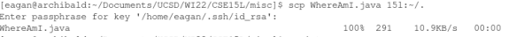

# Week 2 -- Lab Report 1

[Link to index](./index.html)

This lab report, written in the form of a tutorial, will describe how to log into a course-specific account on and interact with the ieng6 cluster at UCSD over openssh.

## Step 1: Installing Visual Studio Cod{ium|e}

*Note: with VS Code being the slow, non-native electronJS nightmare (figure 1) it already is, "proprietary" shouldn't be added to that list. The VS Codium project compiles just the MIT-licensed base without any of Microsoft's nonfree blobs or telemetry.*

This one's pretty simple for real operating systems. For my package manager, the command was `yay -S vscodium-bin`. After that, it's just a matter of opening the integrated terminal and typing `emacs -t .` to get a real text editor, too (figure 2).

*Figure 1: VS Code and Github Desktop using over 2 gigs together at idle, significant on even a beefy gaming laptop. This is your brain on electron.*

*Figure 2: nano running inside vim running inside emacs running inside VS Codium, demonstrating the only use for VS Codium's integrated terminal*

## Step 2: Remotely Connecting

If it isn't already, install openssh (for my package manager, `sudo pacman -S openssh`). To connect without any special configuration, the command is `ssh cs15lwi22apt@ieng6.ucsd.edu`, replacing `cs15lwi22apt` with the relevant username for that class, quarter, and person. If this is the first time connecting, one will recieve a warning that the fingerprint to the server is unrecognized to help protect against MITM attacks; as far as I know, UCSD does not publicly provide the fingerprint of its servers, so one should just type `yes` if this is the first time connecting. Regardless, the server will then ask for the password to the specified account; one should input this and hit enter, upon which he will be logged in and the welcome message in the .bash_profile will print (figure 3).

*Figure 3: the default (I think) welcome message for ieng6 printing upon login*

## Step 3: Trying some Commands

Important commands to know once on the filesystem are `cd` followed by the destination to change directories, `ls` to list files in the current directory (with flags like `-l` to also show permissions, `-a` to show hidden files, or `-t` to order by timestamp, figure 4), `pwd` to print the full working directory name, `cp` and `mv` to copy and move files respectively, with `cp -r` copying recursively (`mv` doesn't need this), `touch` and `mkdir` to make files and directories, and `rm` (optionally with `-r` for recursive) to delete them. `cat` also prints the contents of the files you give it as arguments. 

*Figure 4: running `ls -lat` (`-l` meaning long, including file information; `-a` meaning all, including hidden files; and `-t` ordering the files by timestamp)*

## Step 4: Moving Files with SCP

While the command `ssh` allows access to a remote shell, the openssh protocol facilitates much more, including the ability to copy files to and from a remote machine. In particular, the command for this is `scp <origin> [other origin] ... <destination>`, where origins and destination follow the syntax used in ssh followed by a colon and the desired file path (i.e., `[user]@host:~/example.txt`). For a full example, see figure 5 below.

*Figure 5: copying a file from the local machine to the remote host. Note that the alias 15l is a result of my modification to ~/.ssh/config on my local machine; the standard syntax would read `scp WhereAmI.java cs15lwi22apt@ieng6.ucsd.edu:~/.`*

## Step 5: Setting Up SSH Keys

Typing the password to the remote account each time is cumbersome (and also insecure, but there's no way to disable password-based login on the school cluster that I know of), but this can be avoided using ssh keys, which allows a server with a public key cooresponding to a client's private key to allow the client to log in if the client can sign a message announcing his intent to log in to the server with said private key. To generate ssh keys for the first time, one runs `ssh-keygen` locally, which walks one through the process of creating said key (figure 6), then runs `ssh-copy-id <server name>` one time, which prompts a password to prove that the owner of the just-created keypair can log in before copying the public key to the server. If one did not elect to set up a password for his private keys in the `ssh-keygen` step, one can now log into the server normally with `ssh` without being prompted for a password. 

*Figure 6: the first step of the `ssh-keygen` process. The next will ask the user for an optional password; hit enter without typing anything if passwordless login is desired.*

## Step 6: Optimizing Remote Running

If one did not elect to set up his ssh key with a password, shell scripts run as one's user can now access the server without a password. Moreover, the `ssh` command also allows for optional arguments after the remote hostname, which it executes in the default shell upon logging in. This is useful for editing locally, then compiling and/or running one's edited programs on a remote server without much cumbersome terminal input. In particular, the following bash script (figure 7) will copy `WhereAmI.java` to the home directory of the server named `15l`, then compile and execute it on that server. 

*Figure 7: this bash script first copies WhereAmI.java to the remote server, then compiles and, if succesful, runs WhereAmI.java and WhereAmI.class respectively on the remote server, piping output to the client's tty.*
