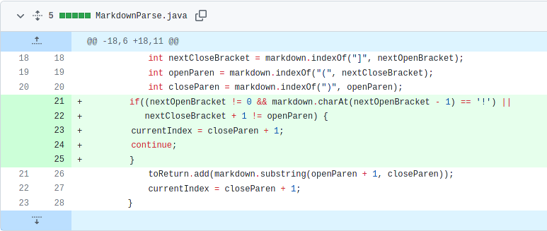
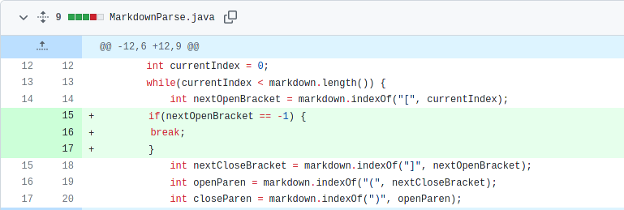
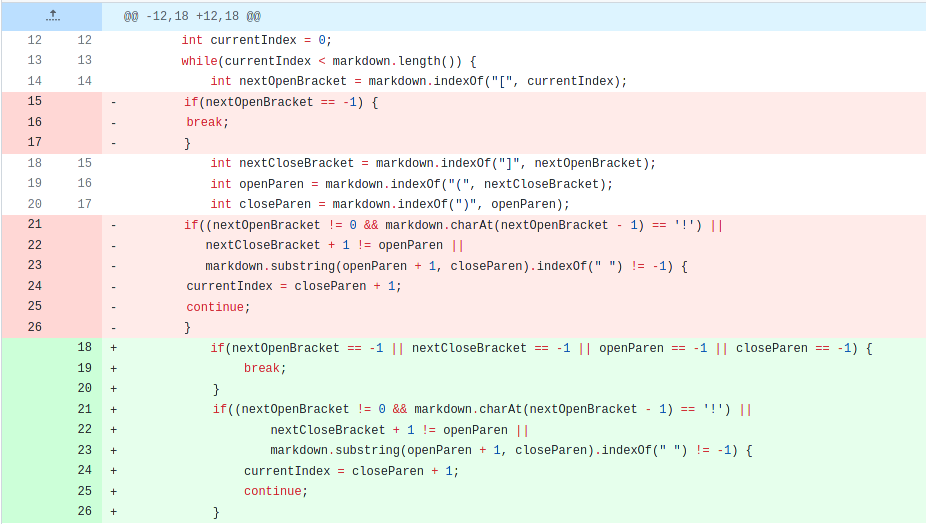

# Week 4 -- Lab Report 2

[Link to index](./index.html)

This lab report will detail the process our group used to debug three bugs in MarkdownParse.java during weeks 3 and 4.

## Change 1 -- Images erroneously considered links



*Note: This commit fixed two bugs, but for this section I'm only considering the lack of a check for preceding exclamation marks to be the bug fixed in this particular section. Because of this, the content after the first `||` in the `if` statement can be ignored.*

[Link to failure-inducing input](https://raw.githubusercontent.com/ekaminetzucsd/markdown-parse/main/test2.md)

Output when this file was passed before the change:

```
$ javac MarkdownParse.java && java MarkdownParse test2.md
```

```
[https://duckduckgo.com, https://kde.org, https://wallpapercave.com/wp/YHSuCPt.jpg]
```

This symptom was that MarkdownParse printed out images in addition to links, and the bug was a lack of a check for whether a pattern represented an image or a link, namely a check that could skip over the potential link with a `continue;` statement if the character immediately before an opening bracket were a `!`. In the case of the failure-inducing input, it meant that the program included `https://wallpapercave.com/wp/YHSuCPt.jpg` in its output list even though this was an image in `test2.md`. 

## Change 2 -- Infinite loop when the last character is not a closing parenthesis in a link

It is worth noting that this diff is earlier in the git tree (and chronologically) than Change 1 for me because my group didn't have the same symptom in their test files; however, we later fixed this issue together and later used my tree in week 4 because it had most of the changes we made in week 3.



[Link to failure-inducing input](https://github.com/ekaminetzucsd/markdown-parse/commit/c399246ae755fcaec6ed3c82fa8289ab312c23d1#diff-61415855ea6df82e4326ef4652ff7f84f1de1ba4f16ed5472b52286764dcb903) 

*Note: Not sure how to link to a raw file from an earlier commit on github. In this iteration of the test file, the effect occurred because of a trailing newline added by my editor (I think?), but in the same commit that fixed the issue, I added more trailing characters to show the problem more obviously.*

Output when this file was passed before the change:

```
$ javac MarkdownParse.java && java MarkdownParse test2.md
```

```
Exception in thread "main" java.lang.OutOfMemoryError: Java heap space
        at java.base/java.util.Arrays.copyOfRange(Arrays.java:3822)
        at java.base/java.lang.StringLatin1.newString(StringLatin1.java:769)
        at java.base/java.lang.String.substring(String.java:2709)
        at MarkdownParse.getLinks(MarkdownParse.java:18)
        at MarkdownParse.main(MarkdownParse.java:26)
```

This symptom was that MarkdownParse began an infinite loop when the last character of an input file was not the closing parenthesis of a link. The underlying bug that caused this was that the `while` loop initially only checked that `currentIndex`, which was set to one character past the last closing parenthesis, was in bounds; when currentIndex passed the last closing parenthesis, it would be set to `0` in the next iteration of the loop as `indexOf(")", currentIndex)` would return `-1` and `-1 + 1` = `0`, so the loop would search from the start again. I presume the reason this happened to me was because my editor added some kind of trailing character when saving the file, although the git diffs imply that this was not the case so I'm still not totally sure why the check in the `while` loop failed for me but not my group. Regardless, this was the bug and the change (which broke the loop if `nextOpeningBracket == -1`, where `-1` is the return value when `indexOf()` doesn't find a String) clearly solved the issue here as well as in instances where the trailing character wasn't mysterious.

## Change 3 -- Infinite loop when an opening bracket does not complete a link before the end of the file



[Link to failure-inducing input](https://raw.githubusercontent.com/ekaminetzucsd/markdown-parse/main/test-file3.md)

*Note: Also failed (same bug) on given tests 4, 7, and 8*

Output when this file was passed before changes:

```
$ javac MarkdownParse.java && java MarkdownParse test-file3.md
```

*(No output, loops forever)*

This symptom was that MarkdownParse loops forever when a link pattern is started but not closed before the end of the file. The underlying bug is that the check for whether no closing parenthesis is found before the end of the file implemented in Change 2 is not robust enough if the first opening bracket exists but no closing parentheses do, because `nextIndex` is still set to one plus the index of the next closing parenthesis, which is `-1` when it is not found, meaning the next loop searches from `nextIndex = 0` all over again. In the failure-inducing input, this manifested as an infinite loop; unlike the loop in Change 2, however, this loop did not have a quick ending because no elements were added to the output list, meaning Java didn't quickly run out of heap space, hence the lack of an output for a reasonably long time (it's possible some runtime variables could cause exceptions but I didn't feel like sticking around for that).
