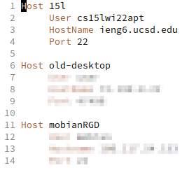
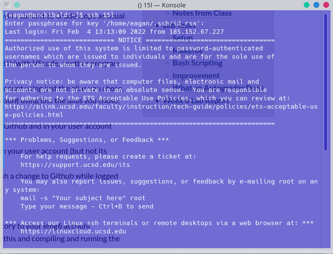

# Week 6 -- Lab Report 3

[Link to index](./index.html)

This report will show the process by which I use hostname aliases to connect over ssh.

## My `~/.ssh/config`, and how I edited it

*My `~/.ssh/config`, slightly censored so as not to leak IP addresses and ssh ports*

This is a screenshot of my `~/.ssh/config` file on my laptop in GUI Emacs. To be honest, I'm pretty sure I used echo and a pipe or GNU nano to write most of this, but I don't usually remember things like which text editor I used six weeks ago. As for the contents of the file, only the first block is relevant, and it essentially converts `15l` to `cs15lwi22apt@ieng6.ucsd.edu -p 22` whenever `15l` is used where an ssh hostname would be in a command that networks via ssh (such as `ssh`, `scp`, `rsync`, `mosh`, etc).

## Connecting to ieng6 with my chosen alias

This shows me logging in to ieng6 with only `ssh 15l`, which is a lot less cumbersome to type than `ssh cs15lwi22apt@ieng6.ucsd.edu`. Note that the password prompt results from me choosing to password-protect my private key, which is fairly important considering I use the same key to authenticate with github.

## Copying a file over `scp` with this alias

This demonstrates the ability to use these ssh host aliases outside just the `ssh` command itself, and tangentially, its use in using `ssh` to run individual commands to verify that this works. In this particular example, `copyme.txt` is created with filler text, copied with `scp` to the home directory of `15l`, (which, thanks to the `~/.ssh/config`, resolves to the correct hostname, user, and port), then verifies that the file copied successfully by using `ssh` to run an individual command, in this case `cat copyme.txt`. Note the password prompt at each step that might break scripts; this can be mitigated with a tool like `ssh-agent` or `sshpass`, and scripts can actually still interface with the keys securely using something like `expect`.
