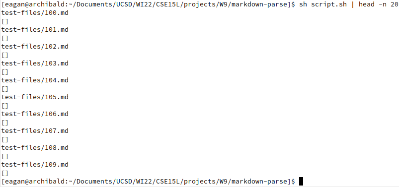

# Week 10 -- Lab Report 5

[Link to index](./index.html)

This report will analyze the correctness of the professor's and our group's implementations of MarkdownParse on two different test cases.

## Filtering results

Prior to the week 9 lab, we were given (and modified) a script, `script.sh`, that printed filenames, then the results of running `java MarkdownParse` on those filenames, for each file in the `test-files` directory. A snippet from running this on the professor's implementation is below:



Notice that the output is long due to the number of test cases. Moreover, most of these don't contain any links at all, and even for those that do, the outputs will be the same between both implementations most of the time. The `diff` command can make this job easier by highlighting where the outputs differ:

First, we pipe the professor's implementation's output into the file `prof-output.txt` (we assume the files are compiled):

```
~/path/to/prof's/repo$ sh script.sh > ~/some/directory/prof-output.txt
```

Next, we pipe our implementation's output into the file `output.txt`:

```
~/path/to/our/repo$ sh script.sh > ~/some/directory/output.txt
```

Finally, we use `diff -y` on the two files to show them in two easy-to-read columns. We then pipe the output into `grep` to search for only lines with a pipe or whitespace followed by either angle bracket, with one line of context before each match to also print the filenames, so that we only print cases where the outputs differ:

```
~/some/directory$ diff -y output.txt prof-output.txt | grep -B 1 -E "\||\s<|\s>"
```

Our result is this:

```
test-files/194.md                                               test-files/194.md
[]                                                            | [url]
--
test-files/201.md                                               test-files/201.md
[]                                                            | [baz]
--
test-files/489.md                                               test-files/489.md
[foo                                                          | []
bar]                                                          <
--
test-files/490.md                                               test-files/490.md
[<foo                                                         | []
bar>]                                                         <
--
test-files/493.md                                               test-files/493.md
[<b, <b, <b>c]                                                  [<b, <b, <b>c]
test-files/494.md                                               test-files/494.md
[\(foo\]                                                      | [\(foo\)]
test-files/495.md                                               test-files/495.md
[foo(and(bar]                                                 | [foo(and(bar))]
test-files/496.md                                               test-files/496.md
[foo(and(bar]                                                 | []
test-files/497.md                                               test-files/497.md
[foo\(and\(bar\]                                              | []
test-files/498.md                                               test-files/498.md
[<foo(and(bar]                                                | []
--
test-files/510.md                                               test-files/510.md
[]                                                            | [/uri]
test-files/511.md                                               test-files/511.md
[]                                                            | [/uri]
test-files/512.md                                               test-files/512.md
[]                                                            | [/uri]
--
test-files/519.md                                               test-files/519.md
[]                                                            | [uri1]
--
test-files/573.md                                               test-files/573.md
[]                                                            | [/url]
test-files/574.md                                               test-files/574.md
[]                                                            | [/url]
--
test-files/577.md                                               test-files/577.md
[]                                                            | [train.jpg]
--
test-files/579.md                                               test-files/579.md
[]                                                            | [<url>]
--
test-files/580.md                                               test-files/580.md
[]                                                            | [/url]
```

Notice that this implementation isn't perfect. In particular, test case 493 isn't different, but `grep` still printed it because it contained whitespace before an angle bracket. This could be excluded by changing `\s` to something like `[\s^\N]`, but it goes to show that using text manipulation will usually have edge cases. There are other ways to exclude outputs that aren't the same: `diff` has `--suppress-common-lines`, for example, but lacks the ability to provide context in the two-column mode, so it would leave out our filenames; even without `-y`, the direction of the context provided by `-C` can't be specified like `grep` allows with `-B`, so the output would be less readable. This implementation also doesn't distinguish between ArrayLists with one element that is an empty string and empty ArrayLists, though this is arguably still correct if the purpose of MarkdownParse is only to print to standard output.

## First test: `201.md`

As shown in the `diff` command above, my group's output is `[]` and the professor's is `[baz]`. In this case, `201.html.test`, which is commonmark's "answer key", indicates that there are no links, just `<p>` tags (so text):

```
<p>[foo]: <bar>(baz)</p>
<p>[foo]</p>
```

This implies that the output should be `[]`, so my group has the correct implementation. The bug present in the professor's implementation is that it doesn't exclude patterns of brackets and parentheses where there are extra characters between the closing bracket and opening parenthesis.

A simple fix for the professor's bug is adding the lines

```
if(nextCloseBracket != -1 && nextCloseBracket + 1 != openParen) {
	currentIndex = nextCloseBracket + 1;
	continue;
}
```

immediately after the line that defines `openParen` (which appears to be line 65). This would immediately start searching for a new link pattern after `nextCloseBracket` if it recognizes that the current pattern cannot be a link because there are characters between the closing bracket and opening parenthesis that would invalidate the link. It checks whether `nextCloseBracket` is `-1` to avoid infinite loops if the first character of the file is an opening parenthesis and the file contains no closing brackets. Note that there are some patterns in the test cases that might have characters between the closing brackets and opening parenthesis of their links that are still valid links according to CommonMark, though these hardly resemble the links we've written MarkdownParse for and would be much more involved changes. However, this change is good enough to rectify this particular bug and pass this particular test case, along with several associated with the same bug.

## Second test: `577.md`

As shown in the `diff` command above, my group's output is `[]` and the professor's is `[train.jpg]`. Commonmark indicates that the conversion to HTML should be

```
<p></p>
```

which contains an `` (image) tag but no `<a>` (link) tags which in turn implies the output should be `[]`, indicating that my group has the correct implementation. The bug present in the professor's implementation is that it doesn't check whether the character before a pair of opening brackets that would otherwise be a link is an exclamation mark, which would make that would-be link an image.

A simple fix for the professor's bug is adding the lines

```
if(nextOpenBracket > 0 && markdownParse.charAt(nextOpenBracket - 1) == '!') {
	currentIndex = nextOpenBracket + 1;
	continue;
}
```

immediately after the line that defines `nextOpenBracket` (which appears to be line 57). This would immediately start searching for a new link pattern after `nextOpenBracket` if it detected that the current link pattern might be an image. It checks whether `nextOpenBracket` is greater than `0` to avoid an `IndexOutOfBoundsException` if the first character of a file is an opening bracket or if the file contains no opening brackets.
